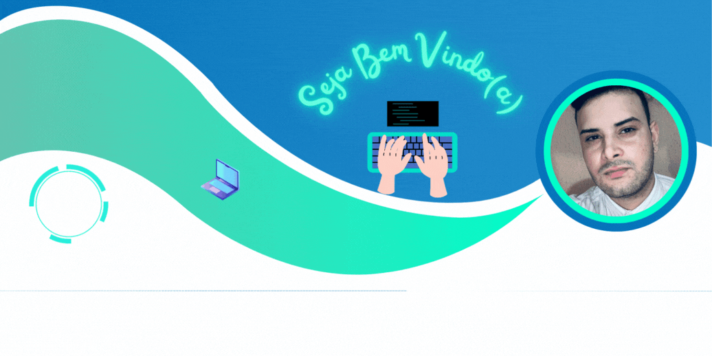
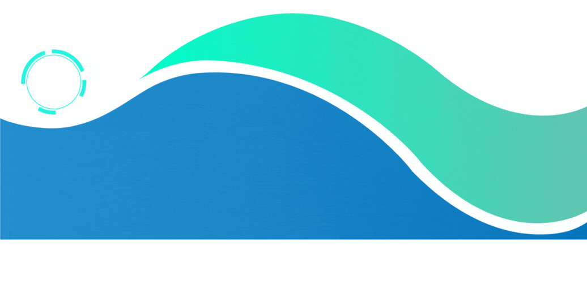

<h1 align="center"><b>Olá , eu sou o Matheus Marques</b></h1>

  

 

## **About me**

 

- Tecnólogo em Análise e Desenvolvimento de Sistemas.
- Desenvolvo aplicações web completas com foco nas melhores práticas de programação.
- Busco oportunidades desafiadoras e que me façam evoluir meus conhecimentos e colocar em prática tudo que aprendi até o momento.
- Amo inovação e tecnologia, pois através delas pode-se construir um futuro melhor.
- Visite meu linkedin e confira a sequência de certificados adquiridos, [Linkedin](https://www.linkedin.com/in/matheus-henrique-couto-marques/)

  

  

## <b> Skills</b>
 

  <ul align="center">
    
<h2 style="display: inline-block">Tecnologias que eu conheço👨🏻‍💻</h2>

  </ul>

<!--tech stack icons-->

  

  
<h3 align="center" > Minhas redes sociais 🤝 </h3>

 

        
        
		
    
    
      

 
 

-----

<h3>Status Github</h3>
 

  
  

</a>

 
 
 

-----

 

Última edição: 23/05/2024

 

